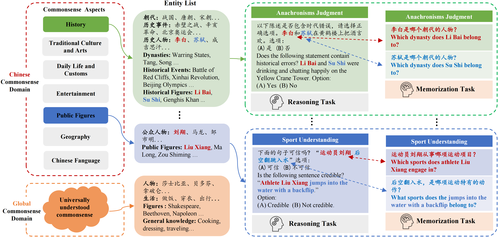

# CHARM✨ Benchmarking Chinese Commonsense Reasoning of LLMs: From Chinese-Specifics to Reasoning-Memorization Correlations

📃[Paper](https://arxiv.org/abs/2403.14112)
🏰[Project Page](https://opendatalab.github.io/CHARM/)

    📖 <a href="./README_ZH.md">   中文</a> | <a href="./README.md">English</a>

## ☀️介绍

我们推出了CHARM，这是首个对大型语言模型 (LLMs) 的中文常识推理能力进行全面且深入评估的测试基准。CHARM 涵盖了世界各地广为人知的常识和独具中国特色的常识。在此基准上，我们对7种英文和12种以中文为主的LLMs进行了评估，同时采用了五种具代表性的提示策略如链式思考，来提升LLMs的推理能力。我们发现，LLMs的语言取向和任务领域均会影响提示策略的有效性，这进一步丰富了之前的研究结果。
我们构建了紧密关联的推理和记忆任务，在此过程中发现，部分LLMs在记忆中文常识方面存在困难，这直接影响了他们的推理能力。然而，还有一些LLMs在记忆表现相似的情况下，他们的推理能力却存在差异。进一步地，我们评估了LLMs独立于记忆的推理能力，并针对典型错误进行了分析。我们的研究精确地突显了LLMs的优势和弱点，从而为其优化提供了明确的方向。此外，这项研究也可为其他领域的相关研究提供参考。

## 🚀 新增功能
- **[2024.3.21]** 论文发布在 [ArXiv](https://arxiv.org/abs/2403.14112). 🔥🔥🔥

## 🧾 待做
- [ ] 发布CHARM的数据。
- [ ] 支持在Opencompass上进行推理。

## ✨CHARM
**CHARM** 是首个全面深入评估大型语言模型（LLMs）在中文常识推理能力的基准测试，它覆盖了国际普遍认知的常识以及独特的中国文化常识。此外，CHARM 还可以评估 LLMs 独立于记忆的推理能力，并分析其典型错误。

### 📖 常识领域
#### 🌐 全球常识领域
全球常识领域包含了具有普遍理解性的常识，覆盖了现代生活中的各种对象和方面，是个体应当了解的知识。这些内容包括基础教育期望个体所掌握的基本知识。涉及到人物时，这些都是在全球范围内广为认可的人物。
#### 🚩 中国常识领域
中国常识领域包含了特定于中国的元素，我们将其分为以下七个方面：
- **历史 *(H)* ：** 包括中国历史上的重要事件和人物、中国的朝代以及关于中国历史的其他基础事实和共享知识。

- **传统文化与艺术 *(CA)*** 囊括中国的传统文化艺术、文学作品和传统生活方式。

- **日常生活和习俗 *(LC)*** 包括现代中国的日常生活、服装、食品、住房、交通、节日等。

- **娱乐 *(E)* :** 包括现代中国日常生活中的电影、电视节目、音乐和其他娱乐活动。
- **公众人物 *(F)*** 涵盖在中国社会广为人知的公众人物。
- **地理 *(G)*** 包括中国的地理分布、自然景观和特色地区文化。

- **汉语语言 *(L)*** 包括中国语言的基本知识，如汉字、成语等。

### 📋 任务列表

- **推理任务 :** CHARM 由7个推理任务组成，包括：**时代错误判断（AJ）、时间理解（TU）、序列理解（SqU）、电影和音乐推荐（MMR）、体育理解（SpU）、自然语言推断（NLI）以及阅读理解（RC）。**

- **记忆任务：** 我们选择了**AJ（时代错误判断）、TU（时间理解）、MMR（电影和音乐推荐）以及 SpU（体育理解）** ，这些被称为记忆-推理-互联（MRI）的任务，我们构建了与这些推理任务相关的记忆任务。

<table align="center">
    <thead>
        <tr>
            <th>任务类型</th>
            <th>任务</th>
            <th>常识领域</th>
            <th>中国常识方面</th>
            <!-- <th>Construction</th> -->
            <th>题目类型</th>
            <th># 题目数量</th>
        </tr>
    </thead>
    <tbody>
        <tr>
            <td rowspan="14" style="vertical-align: middle;">推理</td>
            <td rowspan="2" >时代错误 (AJ)</td>
            <td>中国的</td>
            <td><i>H, AC, LC, F</i></td>
            <!-- <td>[H]</td> -->
            <td>二选项多选题</td>
            <td>150</td>
        </tr>
        <tr>
            <td>全球的</td>
            <td>-</td>
            <!-- <td>[T][H]</td> -->
            <td>二选项多选题</td>
            <td>150</td>
        </tr>
        <tr>
    <td rowspan="2">时间理解 (TU)</td>
    <td>中国的</td>
    <td><i>H, AC, LC</i></td>
    <!-- <td>[H]</td> -->
    <td>四选项多选题</td>
    <td>100</td> 
    <tr>
    <tr>
    <td rowspan="2">顺序理解 (SqU)</td>
    <td>中国的</td>
    <td><i>H, CA, LC, G, L</i></td>
    <!-- <td>[H]</td> -->
    <td>四选项多选题</td>
    <td>100</td>
</tr>
<tr>
    <td>全球的</td>
    <td>-</td>
    <!-- <td>[T][H]</td> -->
    <td>四选项多选题</td>
    <td>100</td>
</tr>

<tr>
    <td rowspan="2">电影和音乐推荐 (MMR)</td>
    <td>中国的</td>
    <td><i>E</i></td>
    <!-- <td>[H]</td> -->
    <td>四选项多选题</td>
    <td>50</td>
</tr>
<tr>
    <td>全球的</td>
    <td>-</td>
    <!-- <td>[T]</td> -->
    <td>四选项多选题</td>
    <td>50</td>
</tr>
<tr>
    <td rowspan="2">体育理解 (SpU)</td>
    <td>中国的</td>
    <td><i>F</i></td>
    <!-- <td>[H]</td> -->
    <td>二选项多选题</td>
    <td>200</td>
</tr>
<tr>
    <td>全球的</td>
    <td>-</td>
    <!-- <td>[H]</td> -->
    <td>二选项多选题</td>
    <td>200</td>
</tr>

<tr>
    <td rowspan="2">自然语言推理 (NLI)</td>
    <td>中国的</td>
    <td><i>G, E, L</i></td>
    <!-- <td>[S][H]</td> -->
    <td>三选项多选题</td>
    <td>100</td>
</tr>
<tr>
    <td>全球的</td>
    <td>-</td>
    <!-- <td>[S]</td> -->
    <td>三选项多选题</td>
    <td>100</td>
</tr>

<tr>
    <td rowspan="2">阅读理解 (RC)</td>
    <td>中国的</td>
    <td>全部7个方面</td>
    <!-- <td>[S]</td> -->
    <td>四选项多选题</td>
    <td>200</td>
</tr>
<tr>
    <td>全球的</td>
    <td>-</td>
    <!-- <td>[S]</td> -->
    <td>四选项多选题</td>
    <td>200</td>
</tr>
<tr>
    <td rowspan="4" style="vertical-align: middle;">Memorization</td>
    <td>时代错误 (AJ)</td>
    <td>中国的</td>
    <td><i>H, AC, LC, F</i></td>
    <!-- <td>[H]</td> -->
    <td>问答题</td>
    <td>150</td>
</tr>

<tr>
    <td>时间理解 (TU)</td>
    <td>中国的</td>
    <td><i>H, AC, LC</i></td>
    <!-- <td>[H]</td> -->
    <td>问答题</td>
    <td>83</td>
</tr>

<tr>
    <td>电影和音乐推荐 (MMR)</td>
    <td>中国的</td>
    <td><i>E</i></td>
    <!-- <td>[H]</td> -->
    <td>问答题</td>
    <td>399</td>
</tr>

<tr>
    <td>体育理解 (SpU)</td>
    <td>中国的</td>
    <td><i>F</i></td>
    <!-- <td>[H]</td> -->
    <td>问答题</td>
    <td>127</td>
</tr>

</tr>

</tr>
    </tbody>
</table>

## 📒模型表现

### 推理任务

<table align="center">
    <thead>
        <tr >
            <th rowspan="2" style="vertical-align: middle;">LLM</th>
            <th colspan="8" style="text-align: center;border-right: 1px solid black;"scope="colgroup" >中国常识领域</th>
            <th colspan="8" scope="colgroup"style="text-align: center;"> 全球常识领域</th>
        </tr>
        <tr style="text-align: center;">
            <th>AJ</th><th>TU</th><th>SqU</th><th>MMR</th><th>SpU</th><th>NLI</th><th>RC</th><th style="border-right: 1px solid black;">Avg.</th>
            <th>AJ</th><th>TU</th><th>SqU</th><th>MMR</th><th>SpU</th><th>NLI</th><th>RC</th><th>Avg.</th>
        </tr>
    </thead>
    <tbody>
        <tr>
            <td>GPT-3.5-1106</td>
            <td>85.33</td><td>39.0</td><td>65.0</td><td>42.0</td><td>80.5</td><td>61.0</td><td>50.5</td><td style="border-right: 1px solid black;">60.48</td>
            <td>90.00</td><td>94.0</td><td>87.0</td><td>46.0</td><td>88.5</td><td>66.0</td><td>49.5</td><td>74.43</td>
        </tr>
        <tr>
    <td>GPT-4-1106</td>
    <td>96.67</td><td><strong>60.0</strong></td><td>85.0</td><td>74.0</td><td>86.0</td><td>77.0</td><td>62.5</td><td style="text-decoration: underline;">77.31</u></td>
    <td><strong>95.33</strong></td><td><strong>98.0</strong></td><td><strong>97.0</strong></td><td><strong>66.0</strong></td><td>90.0</td><td>72.0</td><td><strong>72.0</strong></td><td><strong>84.33</strong></td>
</tr>
<tr>
    <td>LLaMA-2-7B</td>
    <td>51.33</td><td>36.0</td><td>11.0</td><td>14.0</td><td>49.5</td><td>52.0</td><td>8.0</td><td>31.69</td>
    <td>62.67</td><td>17.0</td><td>14.0</td><td>16.0</td><td>49.5</td><td>22.0</td><td>13.0</td><td>27.74</td>
</tr>
<tr>
    <td>LLaMA-2-13B</td>
    <td>56.00</td><td>33.0</td><td>38.0</td><td>30.0</td><td>58.0</td><td>47.0</td><td>38.0</td><td>42.86</td>
    <td>66.67</td><td>24.0</td><td>39.0</td><td>50.0</td><td>53.5</td><td>57.0</td><td>33.5</td><td>46.24</td>
</tr>
<tr>
    <td>LLaMA-2-70B</td>
    <td>57.33</td><td>37.0</td><td>52.0</td><td>32.0</td><td>55.0</td><td>56.0</td><td>41.5</td><td>47.26</td>
    <td>72.67</td><td>84.0</td><td>73.0</td><td>42.0</td><td>64.0</td><td>61.0</td><td>41.5</td><td>62.60</td>
</tr>
<tr>
    <td>Vicuna-7B-v1.5-16k</td>
    <td>52.00</td><td>29.0</td><td>34.0</td><td>32.0</td><td>51.0</td><td>49.0</td><td>35.5</td><td>40.36</td>
    <td>45.33</td><td>64.0</td><td>37.0</td><td>26.0</td><td>58.5</td><td>52.0</td><td>32.5</td><td>45.05</td>
</tr>
<tr>
    <td>Vicuna-13B-v1.5-16k</td>
    <td>64.67</td><td>25.0</td><td>32.0</td><td>26.0</td><td>51.5</td><td>60.0</td><td>40.0</td><td>42.74</td>
    <td>72.67</td><td>74.0</td><td>41.0</td><td>50.0</td><td>68.0</td><td>61.0</td><td>36.0</td><td>57.52</td>
</tr>
<tr style="border-top: 1px solid black;">
    <td>ChatGLM3-6B-32k</td>
    <td>66.00</td><td>40.0</td><td>59.0</td><td>38.0</td><td>77.0</td><td>72.0</td><td>37.5</td><td>55.64</td>
    <td>34.00</td><td>69.0</td><td>71.0</td><td>28.0</td><td>75.5</td><td>63.0</td><td>34.0</td><td>53.50</td>
</tr>
<tr>
    <td>Baichuan2-7B</td>
    <td>76.00</td><td>41.0</td><td>48.0</td><td>38.0</td><td>72.0</td><td>53.0</td><td>49.5</td><td>53.93</td>
    <td>55.33</td><td>65.0</td><td>54.0</td><td>26.0</td><td>60.5</td><td>59.0</td><td>29.0</td><td>49.83</td>
</tr>
<tr>
    <td>Baichuan2-13B</td>
    <td>85.33</td><td>40.0</td><td>48.0</td><td>46.0</td><td>72.5</td><td>66.0</td><td>51.5</td><td>58.48</td>
    <td>77.33</td><td>74.0</td><td>58.0</td><td>40.0</td><td>71.0</td><td>61.0</td><td>39.0</td><td>60.05</td>
</tr>
<tr>
    <td>InternLM2-7B</td>
    <td>88.00</td><td>38.0</td><td>58.0</td><td>38.0</td><td>76.0</td><td>81.0</td><td>25.0</td><td>57.71</td>
    <td>74.67</td><td>80.0</td><td>62.0</td><td>20.0</td><td>78.0</td><td><strong>76.0</strong></td><td>23.5</td><td>59.17</td>
</tr>
<tr>
    <td>InternLM2-20B</td>
    <td>88.00</td><td>55.0</td><td>54.0</td><td>44.0</td><td>74.5</td><td>80.0</td><td>23.0</td><td>59.79</td>
    <td>82.67</td><td>83.0</td><td>61.0</td><td>14.0</td><td>74.5</td><td>72.0</td><td>27.0</td><td>59.17</td>
</tr>
<tr>
    <td>Yi-6B</td>
    <td>70.67</td><td>32.0</td><td>47.0</td><td>32.0</td><td>75.0</td><td>50.0</td><td>42.0</td><td>49.81</td>
    <td>79.33</td><td>63.0</td><td>43.0</td><td>14.0</td><td>70.5</td><td>57.0</td><td>33.5</td><td>51.48</td>
</tr>
<tr>
    <td>Yi-34B</td>
    <td>96.00</td><td>55.0</td><td>89.0</td><td>76.0</td><td><strong>88.5</strong></td><td>72.0</td><td>51.5</td><td>75.43</td>
    <td>88.67</td><td>92.0</td><td>87.0</td><td>56.0</td><td>89.0</td><td>70.0</td><td>47.5</td><td>75.74</td>
</tr>
<tr>
    <td>DeepSeek-7B</td>
    <td>81.33</td><td>34.0</td><td>50.0</td><td>50.0</td><td>79.5</td><td>57.0</td><td>31.5</td><td>54.76</td>
    <td>68.00</td><td>76.0</td><td>47.0</td><td>50.0</td><td>72.5</td><td>59.0</td><td>32.5</td><td>57.86</td>
</tr>
<tr>
    <td>DeepSeek-67B</td>
    <td>96.67</td><td>57.0</td><td>83.0</td><td><strong>92.0</strong></td><td>87.5</td><td>77.0</td><td>34.5</td><td>75.38</td>
    <td>90.00</td><td>95.0</td><td>86.0</td><td>22.0</td><td>88.0</td><td>73.0</td><td>39.0</td><td>70.43</td>
</tr>
<tr>
    <td>Qwen-7B</td>
    <td>70.67</td><td>38.0</td><td>55.0</td><td>48.0</td><td>71.0</td><td>57.0</td><td>49.5</td><td>55.60</td>
    <td>74.67</td><td>78.0</td><td>69.0</td><td>50.0</td><td>72.5</td><td>55.0</td><td>36.0</td><td>62.17</td>
</tr>
<tr>
    <td>Qwen-14B</td>
    <td>87.33</td><td>54.0</td><td>77.0</td><td>60.0</td><td>82.5</td><td>66.0</td><td>55.0</td><td>68.83</td>
    <td>84.00</td><td>83.0</td><td>83.0</td><td>44.0</td><td>84.5</td><td>71.0</td><td>40.0</td><td>69.93</td>
</tr>
<tr>
    <td>Qwen-72B</td>
    <td><strong>98.00</strong></td><td>59.0</td><td><strong>91.0</strong></td><td>84.0</td><td>86.5</td><td><strong>84.0</strong></td><td><strong>67.5</strong></td><td><strong>81.43</strong></td>
    <td>94.00</td><td>92.0</td><td>93.0</td><td>64.0</td><td><strong>93.0</strong></td><td>71.0</td><td>63.5</td><td style="text-decoration: underline;">81.50</u></td>
</tr>
    </tbody>
</table>
我们选择了经验证的最优提示策略：对于英文 LLMs 使用 XLT，对于中文为主的 LLMs 使用 ZH-CoT。上表中显示了 LLMs 在 CHARM 推理任务上的准确率。详细实验结果请阅读论文。

### 提示策略
我们对两个维度上的 19 × 5 LLM-提示组合进行了平均处理，得到了以下结果。
<table align="center">
    <thead>
        <tr>
            <th></th>
            <th><strong>提示策略</strong></th>
            <th><strong>所有模型平均</strong></th>
            <th><strong>中文大模型平均</strong></th>
            <th><strong>英文大模型平均</strong></th>
        </tr>
    </thead>
    <tbody>
        <tr>
            <td rowspan="5">所有常识领域平均</td>
            <td>Direct</td>
            <td>46.28</td>
            <td>48.41</td>
            <td>42.64</td>
        </tr>
        <tr>
            <td>ZH-CoT</td>
            <td>56.66</td>
            <td><strong>62.40</strong></td>
            <td>46.81</td>
        </tr>
        <tr>
            <td>EN-CoT</td>
            <td>54.46</td>
            <td>58.19</td>
            <td>48.06</td>
        </tr>
        <tr>
            <td>Translate-EN</td>
            <td>53.88</td>
            <td>55.51</td>
            <td>51.07</td>
        </tr>
        <tr>
            <td>XLT</td>
            <td>56.81</td>
            <td>59.09</td>
            <td><strong>52.90</strong></td>
        </tr>
        <tr>
            <td rowspan="5">中国常识领域平均</td>
            <td>Direct</td>
            <td>45.43</td>
            <td>47.76</td>
            <td>41.44</td>
        </tr>
        <tr>
            <td>ZH-CoT</td>
            <td><strong>56.35</strong></td>
            <td><strong>62.23</strong></td>
            <td>46.26</td>
        </tr>
        <tr>
            <td>EN-CoT</td>
            <td>52.06</td>
            <td>56.36</td>
            <td>44.68</td>
        </tr>
        <tr>
            <td>Translate-EN</td>
            <td>47.25</td>
            <td>47.82</td>
            <td>46.27</td>
        </tr>
        <tr>
            <td>XLT</td>
            <td>53.80</td>
            <td>56.63</td>
            <td><strong>48.96</strong></td>
        </tr>
        <tr>
            <td rowspan="5">全球常识领域平均</td>
             <td>Direct</td>
            <td>47.13</td>
            <td>49.05</td>
            <td>43.85</td>
        </tr>
        <tr>
            <td>ZH-CoT</td>
            <td>56.96</td>
            <td>62.57</td>
            <td>47.35</td>
        </tr>
        <tr>
            <td>EN-CoT</td>
            <td>56.85</td>
            <td>60.01</td>
            <td>51.44</td>
        </tr>
        <tr>
            <td>Translate-EN</td>
            <td><strong>60.50</strong></td>
            <td><strong>63.20</strong></td>
            <td>55.87</td>
        </tr>
        <tr>
            <td> XLT</td>
            <td>59.82</td>
            <td>61.56</td>
            <td><strong>56.84</strong></td>
        </tr>

</table>

💡 结果显示，**LLMs的语言取向** 和 **任务的知识领域**会影响提示策略的表现，这进一步丰富了先前的研究发现。

- **从 LLM 维度来看**，不同的 LLMs 显然偏好不同的提示策略：在5种策略中，XLT 对于英文 LLMs 始终表现优秀，而对于面向中文的 LLMs，尽管存在一些复杂性，但 ZH-CoT 通常表现最好。

- **从常识领域维度来看**，使用英文进行推理的策略（如 XLT、Translate-EN 等）适用于全球常识领域；然而，ZH-CoT 在中国常识领域中的表现通常更好。

这里的结论与前面的研究有所不同 ([Huang et al., 2023a](https://arxiv.org/pdf/2305.07004.pdf), [Zhang et al., 2023a](https://aclanthology.org/2023.emnlp-main.491.pdf) , [Shi et al., 2022](https://arxiv.org/pdf/2210.03057.pdf))，之前的研究提出，在处理非英文的推理任务时，使用英文比使用题目本身的语言更为有效。

### 综合推理与记忆的对比
我们评估了在 MRI 任务上，综合推理与记忆之间的相关性。下面是 LLMs 在 4 个 MRI 任务上的平均表现。

💡 如图所示，这19个 LLMs 大致可以被分为三种类型：

- **类型 I：低记忆能力和低综合推理能力。** 我们发现，除了 OpenAI 的 GPT 系列外，所有其他的英文 LLMs 都属于这个类型。

- **类型 II：高记忆能力和中等综合推理能力。** GPT3.5 和所有规模在 30B 以下的面向中文的 LLMs 都属于这个类型。值得注意的是，一些 LLMs 具有高度的记忆性能，但相对较差的综合推理能力。

- **类型 III：超高记忆能力和高综合推理能力。** 个类别包括 GPT4 和三个规模超过 30B 的面向中文的 LLMs。

### 独立于记忆的推理

我们提出了两种方法来比较 LLMs 在 MRI 任务上独立于记忆的推理能力： **Mono-LLM-Memorization (FRMM) and Memorization-Independent Battles among LLMs (MIB)**   （关于 FRMM 和 MIB 方法的具体细节，请参阅论文）。以下是 FRMM 和 MIB 方法的结果。

<table align="center">
    <thead>
        <tr>
            <th rowspan="2">排行</th>
            <th rowspan="2">综合推理</th>
            <th colspan="2">独立于记忆的推理</th>
        </tr>
        <tr>
            <th>FRMM</th>
            <th>MIB</th>
        </tr>
    </thead>
    <tbody>
        <tr>
            <td>1</td>
            <td>DeepSeek-67B</td>
            <td>Yi-34B (↑3)</td>
            <td>GPT-4 (↑2)</td>
        </tr>
        <tr>
            <td>2</td>
            <td>Qwen-72B</td>
            <td>DeepSeek-67B (↓1)</td>
            <td>Yi-34B (↑2)</td>
        </tr>
        <tr>
            <td>3</td>
            <td>GPT-4</td>
            <td>GPT-4 (-)</td>
            <td>Qwen-72B (↓1)</td>
        </tr>
        <tr>
            <td>4</td>
            <td>Yi-34B</td>
            <td>Qwen-72B (↓2)</td>
            <td>DeepSeek-67B (↓3)</td>
        </tr>
        <tr>
            <td>5</td>
            <td>Qwen-14B</td>
            <td>GPT-3.5 (↑2)</td>
            <td>GPT-3.5 (↑2)</td>
        </tr>
        <tr>
            <td>6</td>
            <td>InternLM2-20B</td>
            <td>Qwen-14B (↓1)</td>
            <td>Qwen-14B (↓1)</td>
        </tr>
        <tr>
            <td>7</td>
            <td>GPT-3.5</td>
            <td>InternLM2-20B (↓1)</td>
            <td>InternLM2-20B (↓1)</td>
        </tr>
        <tr>
            <td>8</td>
            <td>InternLM2-7B</td>
            <td>InternLM2-7B (-)</td>
            <td>InternLM2-7B (-)</td>
        </tr>
        <tr>
            <td>9</td>
            <td>DeepSeek-7B</td>
            <td>Baichuan2-13B (↑1)</td>
            <td>Baichuan2-13B (↑1)</td>
        </tr>
        <tr>
            <td>10</td>
            <td>Baichuan2-13B</td>
            <td>DeepSeek-7B (↓1)</td>
            <td>DeepSeek-7B (↓1)</td>
        </tr>
        <tr>
            <td>11</td>
            <td>Baichuan2-7B</td>
            <td>Yi-6B (↑3)</td>
            <td>Baichuan2-7B (-)</td>
        </tr>
        <tr>
            <td>12</td>
            <td>ChatGLM3-6B</td>
            <td>ChatGLM3-6B (-)</td>
            <td>ChatGLM3-6B (-)</td>
        </tr>
        <tr>
            <td>13</td>
            <td>Qwen-7B</td>
            <td>Baichuan2-7B (↓2)</td>
            <td>Qwen-7B (-)</td>
        </tr>
        <tr>
            <td>14</td>
            <td>Yi-6B</td>
            <td>Qwen-7B (↓1)</td>
            <td>Yi-6B (-)</td>
        </tr>
        <tr>
            <td>15</td>
            <td>LLaMA-2-70B</td>
            <td>LLaMA-2-13B (↑1)</td>
            <td>LLaMA-2-13B (↑1)</td>
        </tr>
        <tr>
            <td>16</td>
            <td>LLaMA-2-13B</td>
            <td>LLaMA-2-70B (↓1)</td>
            <td>LLaMA-2-70B (↓1)</td>
        </tr>
        <tr>
            <td>17</td>
            <td>Vicuna-13B-v1.5</td>
            <td>Vicuna-13B-v1.5 (-)</td>
            <td>Vicuna-13B-v1.5 (-)</td>
        </tr>
        <tr>
            <td>18</td>
            <td>Vicuna-7B-v1.5</td>
            <td>LLaMA-2-7B (↑1)</td>
            <td>Vicuna-7B-v1.5 (-)</td>
        </tr>
        <tr>
            <td>19</td>
            <td>LLaMA-2-7B</td>
            <td>Vicuna-7B-v1.5 (↓1)</td>
            <td>LLaMA-2-7B (-)</td>
        </tr>
    </tbody>
</table>

💡 如果大型语言模型（LLMs）对保留的推理问题提供了错误的回答，这些可以被称为独立于记忆的推理错误。我们通过手动审查推理过程来分析这些错误，并将它们归类为四个主要类型

- **理解错误：** 在这种情况下，LLM 无法准确理解问题，包括误解内容，忽视甚至修改前提中的重要信息，以及未能把握问题的核心查询。

- **知识错误：** LLM 在推理过程中融入了不准确的知识。值得强调的是，与推理问题相关的知识片段在之前的相关记忆问题中已经被检查过，而 LLM 正确地回答了这些问题。然而，在推理阶段，LLM 输出的信息是不正确的。

- **逻辑错误：** LLM 犯了逻辑推理错误，比如数学推理错误，无法基于足够的信息得出正确的结论，或者达到正确的结论但输出了错误的选项。
- **其他错误：** 分布零散，相对罕见的其他类型的错误。

💡 独立于记忆的推理错误的分布

💡 LLMs 的三种类型的独立于记忆的推理错误示例

>

## 🖊️ 引用

## 💳 License

此项目是在Apache 2.0许可下发布的 [license](./LICENSE).